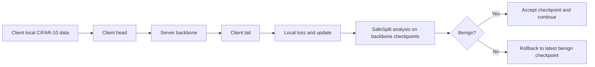

# SafeSplit Midterm Reproduction

Concise, notebook-first reproduction of **SafeSplit: A Novel Defense Against Client-Side Backdoor Attacks in Split Learning** for the distributed deep learning midterm.

This project implements:
- U-shaped split learning with `head -> backbone -> tail`
- CIFAR-10 client partitioning with non-IID control
- client-side semantic and pixel backdoor attacks
- the SafeSplit defense with DCT scoring, rotational scoring, and rollback
- reduced baselines: `none`, `safesplit`, `dp`, and `krum`

## Quick Walkthrough
The main file is `SafeSplit_walkthrough.ipynb`.

Use it in this order:
1. Read the first half for the step-by-step explanation of split learning, poisoning, SafeSplit scores, and rollback.
2. Go to `## Run Real Experiments In The Notebook` and set `NOTEBOOK_EXPERIMENT_PRESET`.
3. Run the `## Midterm Comparison Suites` cell to generate the main paper-style results directly in the notebook.

Preset meanings:
- `lite`: fastest sanity check
- `medium`: interactive notebook run
- `paper`: closest midterm reproduction setting

The notebook is the main way to run the project, but the same experiment engine can also be called from `.py` entrypoints when needed.

## At A Glance
### Reproduced Pipeline
This is the most useful proposal-style diagram to add here. It matches the implemented midterm reproduction flow and is a simplified version of the proposal's overall workflow view.



Note: the proposal also included a trust-score extension. That extension is not part of the current reported reproduction results, so it is intentionally omitted from this README pipeline.

### Small Project Map
This is the quickest file-level view of the project:

```text
SafeSplit_Distributed_DL/
├─ SafeSplit_walkthrough.ipynb   # main notebook: explanation + experiments + results
├─ main.py                       # shared experiment backend used by notebook and CLI
├─ run_experiments.py            # optional batch runner for the case matrix
├─ config.py                     # shared presets and experiment settings
├─ evaluate.py                   # MA / BA evaluation helpers
├─ data/
│  ├─ dataset.py                 # CIFAR-10 loading and client partitioning
│  └─ backdoor.py                # semantic and pixel backdoor generation
├─ models/
│  └─ split_models.py            # split model definitions
├─ training/
│  └─ trainer.py                 # split-learning training loop
├─ defense/
│  ├─ safesplit.py               # SafeSplit scoring + rollback logic
│  └─ baselines.py               # reduced DP / KRUM-style baselines
├─ results/                      # saved JSON experiment outputs
└─ assets/readme/                # screenshots/plots used in this README
```

## How To Run
```bash
pip install -r requirements.txt
```

Then open `SafeSplit_walkthrough.ipynb` and run it with:
- `NOTEBOOK_EXPERIMENT_PRESET = "lite"` for quick feedback
- `NOTEBOOK_EXPERIMENT_PRESET = "medium"` for notebook-friendly experiments
- `NOTEBOOK_EXPERIMENT_PRESET = "paper"` for the main reported results

Set `NOTEBOOK_SAVE_JSON = True` if you also want the notebook runs saved into `results/`.

If you prefer Python entrypoints instead of the notebook, you can still run:

```bash
python main.py --preset paper --defense safesplit --backdoor semantic
python run_experiments.py --preset paper
```

## Main Results
The most important outputs come from the notebook cell under `## Midterm Comparison Suites`.

### 1. Table II Subset
This is the clearest defense check: without defense, both attacks achieve near-perfect backdoor success; with SafeSplit, backdoor accuracy drops sharply while clean accuracy stays usable.


Brief read:
- `semantic + none`: `BA = 100.0`
- `semantic + safesplit`: `BA = 0.0`
- `pixel + none`: `BA = 99.99`
- `pixel + safesplit`: `BA = 6.62`

This is the main qualitative paper result reproduced in our notebook.

### 2. Table III Subset
This is the IID-rate sweep. As data becomes more IID, clean accuracy improves, while SafeSplit keeps suppressing the semantic backdoor across all tested IID settings.


Brief read:
- `none` keeps `BA = 100.0` at `iid_rate = 0.6`, `0.8`, and `1.0`
- `safesplit` keeps `BA = 0.0` at all three IID rates
- clean MA rises with IID for both, which is the expected trend

### 3. Reduced Baseline Panel
This is the compact baseline comparison. It shows that `dp` hurts clean performance without stopping the attack, while `krum` and `safesplit` both reduce BA, with SafeSplit giving the better MA/BA tradeoff here.


Brief read:
- `none`: `MA = 43.34`, `BA = 100.0`
- `dp`: `MA = 11.33`, `BA = 100.0`
- `krum`: `MA = 31.85`, `BA = 0.0`
- `safesplit`: `MA = 36.5`, `BA = 0.0`

## What To Compare To The Paper
From the notebook:
- `TABLE_II_CASES` corresponds to the project’s `Table II` comparison subset
- `TABLE_III_CASES` corresponds to the project’s `Table III` comparison subset
- `BASELINE_CASES` is the reduced baseline/figure-style comparison panel

The earlier single-run demo cell is only a walkthrough sanity check and is not the result cell used for paper comparison.

## Optional CLI Runs
The notebook is the recommended interface, but the same runner can also be used from the CLI:

```bash
python main.py --preset lite --defense safesplit --backdoor semantic
python main.py --preset paper --defense none --backdoor pixel
python run_experiments.py --preset lite
python run_experiments.py --preset medium
python run_experiments.py --preset paper
```
