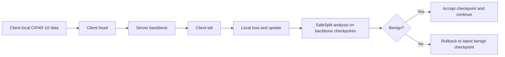
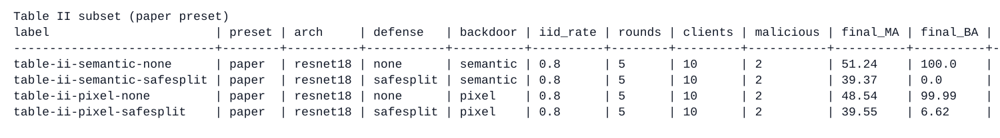
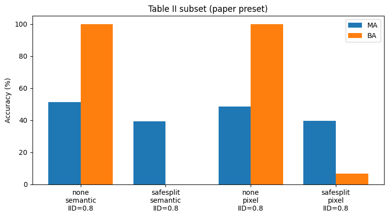
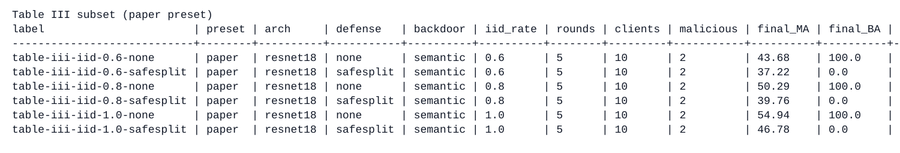
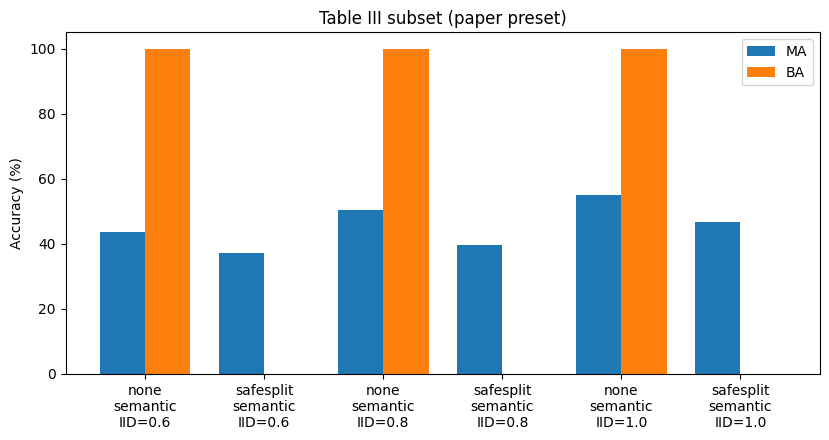
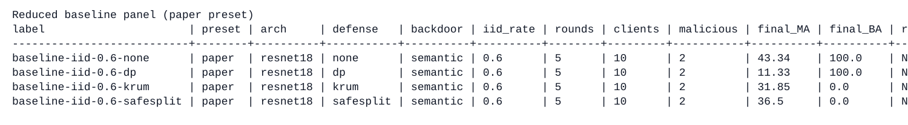
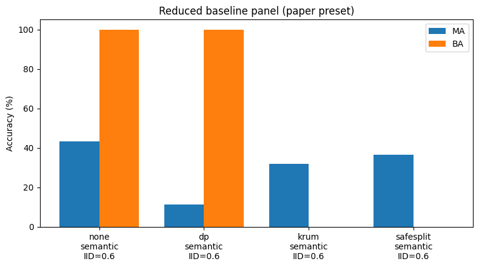

# SafeSplit Midterm Reproduction

This repository reproduces the midterm scope of **SafeSplit: A Novel Defense Against Client-Side Backdoor Attacks in Split Learning** (NDSS 2025) for a distributed deep learning course project. The implementation covers U-shaped split learning (`head → backbone → tail`), CIFAR-10 partitioning with controlled non-IID splits, client-side semantic and pixel backdoors, the SafeSplit defense (DCT and rotational scores with rollback), and reduced baselines (`none`, `safesplit`, `dp`, `krum`).

## Notebook workflow

`SafeSplit_walkthrough.ipynb` is the primary interface. The notebook explains the pipeline, then runs experiments under `## Run Real Experiments In The Notebook` via `NOTEBOOK_EXPERIMENT_PRESET`, and produces the main comparisons under `## Midterm Comparison Suites`.

Presets:

| Preset   | Role                                      |
| -------- | ----------------------------------------- |
| `lite`   | Short runs for sanity checks              |
| `medium` | Interactive full notebook experiments     |
| `paper`  | Settings closest to the reported midterm  |

The same experiment logic lives in Python modules and can be invoked from `main.py` or `run_experiments.py` when batch or script execution is preferred.

## Pipeline overview

The diagram summarizes the implemented flow: clients hold local CIFAR-10 data; activations pass through head, server backbone, and tail; updates are analyzed against a SafeSplit checkpoint history; benign updates are accepted and suspicious ones trigger rollback to the last accepted backbone state. A trust score extension from the original proposal is not implemented and is omitted from this diagram.



## Repository layout

```text
SafeSplit_Distributed_DL/
├─ SafeSplit_walkthrough.ipynb   # narrative, experiments, figures
├─ main.py                       # shared experiment runner (notebook + CLI)
├─ run_experiments.py            # optional matrix of CLI runs
├─ config.py                     # presets and experiment parameters
├─ evaluate.py                   # main task and backdoor accuracy
├─ data/
│  ├─ dataset.py                 # CIFAR-10 loading and client splits
│  └─ backdoor.py                # semantic and pixel triggers
├─ models/
│  └─ split_models.py            # split model definitions
├─ training/
│  └─ trainer.py                 # split learning training loop
├─ defense/
│  ├─ safesplit.py               # SafeSplit scoring and rollback
│  └─ baselines.py               # DP and distance based aggregation baselines
├─ results/                      # optional JSON outputs (gitignored)
└─ assets/readme/                # tables and plots embedded below
```

## Execution

```bash
pip install -r requirements.txt
```

After installing dependencies, runs proceed in `SafeSplit_walkthrough.ipynb` by choosing `NOTEBOOK_EXPERIMENT_PRESET` among `lite`, `medium`, and `paper`, then executing the comparison suite cells. `NOTEBOOK_SAVE_JSON = True` persists JSON logs under `results/`.

Equivalent CLI examples:

```bash
python main.py --preset paper --defense safesplit --backdoor semantic
python run_experiments.py --preset paper
```

## Results summary

Figures and tables below were exported from the notebook suite (`## Midterm Comparison Suites`) under the `paper` preset unless noted otherwise in the project assets.

### Defense comparison (Table II correspondence)

Without defense, semantic and pixel attacks reach near perfect backdoor accuracy (`BA`). SafeSplit drives `BA` down while keeping main task accuracy (`MA`) in a usable range.





Representative values from the embedded run: `semantic + none` gives `BA = 100.0`; `semantic + safesplit` gives `BA = 0.0`; `pixel + none` gives `BA ≈ 99.99`; `pixel + safesplit` gives `BA = 6.62`.

### IID sweep (Table III correspondence)

Increasing the IID fraction improves `MA` for both defended and undefended runs. SafeSplit maintains `BA = 0.0` on the semantic attack across IID rates `0.6`, `0.8`, and `1.0`, while `none` remains at `BA = 100.0`.





### Baseline panel

The reduced baseline panel compares `none`, simplified DP, a baseline modeled on KRUM, and SafeSplit. DP lowers `MA` without removing the backdoor in this setup; KRUM and SafeSplit both reach `BA = 0.0`, with SafeSplit offering the stronger `MA` tradeoff in the reported run (`none`: `MA = 43.34`, `BA = 100.0`; `dp`: `MA = 11.33`, `BA = 100.0`; `krum`: `MA = 31.85`, `BA = 0.0`; `safesplit`: `MA = 36.5`, `BA = 0.0`).





## Mapping to paper tables

In the notebook, `TABLE_II_CASES` aligns with the paper’s Table II comparison, `TABLE_III_CASES` with the IID sweep reported as Table III, and `BASELINE_CASES` with the reduced baseline figure panel. Earlier demonstration cells illustrate mechanics only and are excluded from those tabular comparisons.

## CLI reference

```bash
python main.py --preset lite --defense safesplit --backdoor semantic
python main.py --preset paper --defense none --backdoor pixel
python run_experiments.py --preset lite
python run_experiments.py --preset medium
python run_experiments.py --preset paper
```
