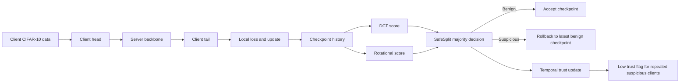
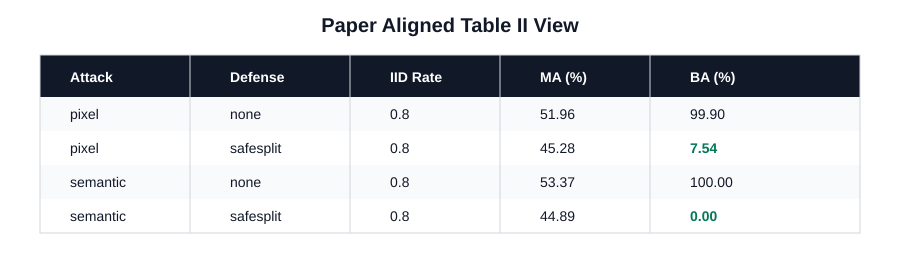
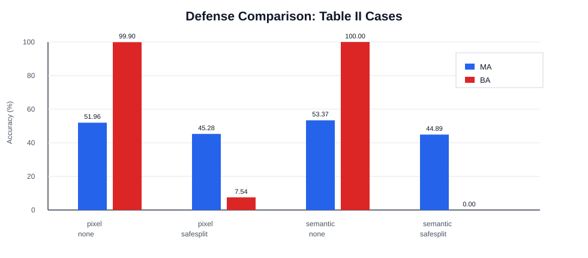
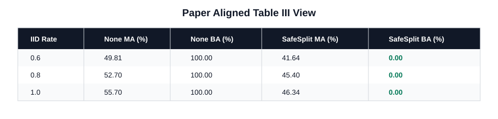
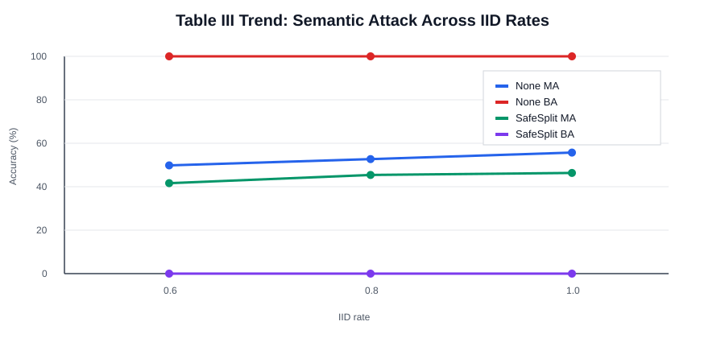
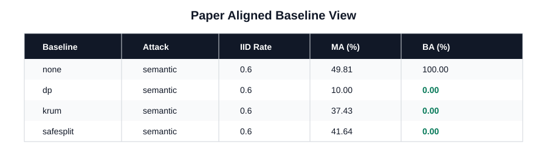
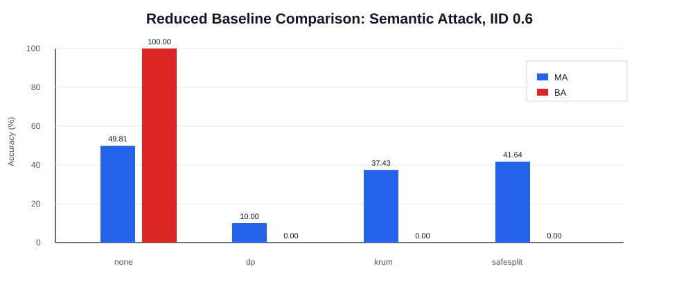
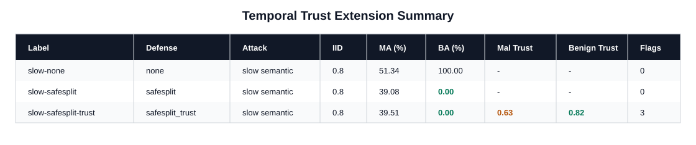
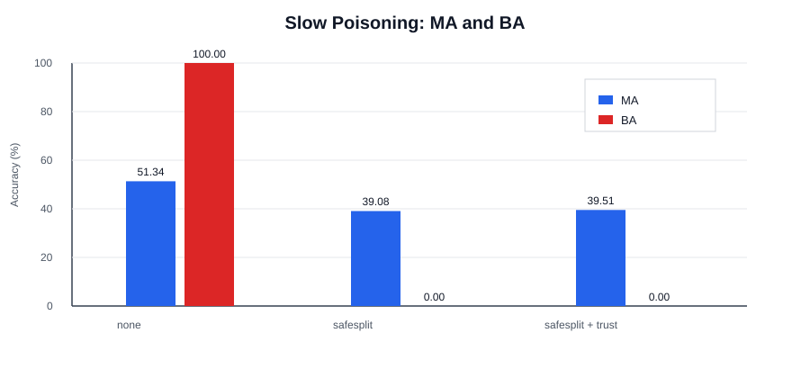
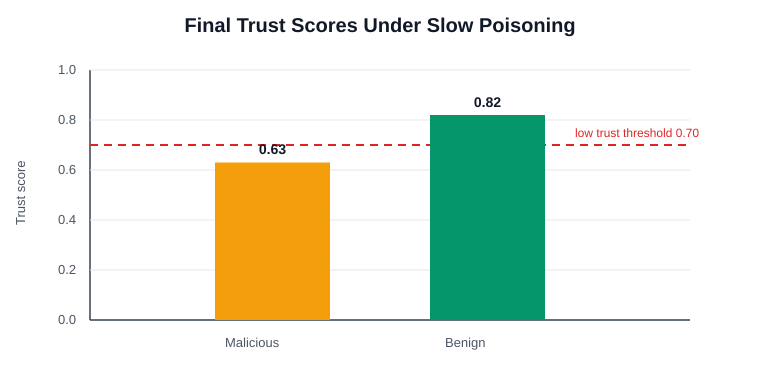

# SafeSplit Reproduction

This repository reproduces **SafeSplit: A Novel Defense Against Client-Side Backdoor Attacks in Split Learning** (NDSS 2025). The project implements U-shaped split learning on CIFAR-10, controlled non-IID client partitions, client-side pixel and semantic backdoor attacks, SafeSplit checkpoint analysis and rollback, reduced defense baselines, and a temporal trust score extension for slow poisoning.

The main goal is to show whether SafeSplit can preserve the clean task while reducing backdoor accuracy when malicious clients poison their local data. The notebook is the primary report and execution interface, while the Python modules keep the implementation reusable.

## Notebook workflow

`SafeSplit_walkthrough.ipynb` is the main entry point. It explains the pipeline, shows the split-learning mechanics, runs the experiments, formats the result tables, and produces the plots used below.

Presets:

| Preset | Role |
| --- | --- |
| `lite` | Short sanity checks |
| `medium` | Interactive full notebook runs |
| `paper` | Main reported configuration |

The same experiment logic is shared by the notebook, `main.py`, and `run_experiments.py`, so the project can be run interactively or from scripts.

## Pipeline overview

The split model is organized as `client head -> server backbone -> client tail`. After each client update, SafeSplit compares recent backbone checkpoints using low-frequency DCT signatures and rotational signatures. Updates that match the benign majority are accepted. Suspicious updates trigger rollback to the latest benign checkpoint. The extension adds a temporal trust score to track clients that repeatedly show mild suspicious behavior.



## Repository layout

```text
SafeSplit_Distributed_DL/
├─ SafeSplit_walkthrough.ipynb   # explanation, experiments, tables, plots
├─ main.py                       # shared experiment runner
├─ run_experiments.py            # optional batch runner
├─ config.py                     # presets and experiment parameters
├─ evaluate.py                   # main task and backdoor accuracy
├─ data/
│  ├─ dataset.py                 # CIFAR-10 loading and client splits
│  └─ backdoor.py                # pixel, semantic, and scheduled poisoning
├─ models/
│  └─ split_models.py            # split model definitions
├─ training/
│  └─ trainer.py                 # split learning training loop
├─ defense/
│  ├─ safesplit.py               # SafeSplit and temporal trust defense
│  └─ baselines.py               # DP and KRUM style baselines
├─ results/                      # optional JSON outputs
└─ assets/readme/                # result tables and plots
```

## Execution

```bash
# one-time: create Python 3.10 base env containing uv
conda create -y -n safesplit-uv310 python=3.10
conda run -n safesplit-uv310 python -m pip install uv

# from repository root
UV_CACHE_DIR=.uv-cache conda run -n safesplit-uv310 uv sync --python 3.10
source .venv/bin/activate
```

After installing dependencies, the recommended path is to open `SafeSplit_walkthrough.ipynb`, set `NOTEBOOK_EXPERIMENT_PRESET = "paper"`, restart the kernel, and run all cells. The notebook selects a reporting seed for the paper-style comparison suite and prints a sanity check before the extension section.

Optional CLI examples:

```bash
python main.py --preset paper --defense safesplit --backdoor semantic
python run_experiments.py --preset paper
```

## Results summary

The reported run uses the `paper` preset and selected reporting seed `42`. Main Task Accuracy (`MA`) is measured on clean CIFAR-10 test data. Backdoor Accuracy (`BA`) is measured on triggered test data, where lower values indicate a stronger defense.

### Defense comparison

This experiment compares pixel and semantic attacks with and without SafeSplit. Without defense, both attacks reach near-perfect backdoor accuracy. SafeSplit suppresses the semantic attack completely and strongly reduces the pixel attack while keeping useful clean accuracy.





Key result: `semantic + none` gives `BA = 100.0`, while `semantic + safesplit` gives `BA = 0.0`. For the pixel attack, SafeSplit lowers `BA` from `99.9` to `7.54`.

### IID sweep

This experiment evaluates the semantic attack at IID rates `0.6`, `0.8`, and `1.0`. The undefended runs keep `BA = 100.0` at every IID rate. SafeSplit keeps `BA = 0.0` across all IID settings.





The trend plot shows that clean accuracy improves as the data becomes more IID. SafeSplit has lower `MA` than no defense, but it removes the backdoor across the full IID sweep.

### Reduced baselines

The baseline panel compares no defense, simplified differential privacy, a KRUM style distance baseline, and SafeSplit at `IID = 0.6` under a semantic attack. No defense keeps high clean accuracy but leaves the backdoor active. The simplified DP baseline removes the backdoor in this run but collapses clean accuracy. KRUM and SafeSplit both remove the backdoor, with SafeSplit keeping the better clean accuracy.





## Extension: Temporal Trust Score

The extension adds a temporal trust score on top of SafeSplit. A malicious client starts with mild poisoning and gradually increases the poison rate. SafeSplit still handles checkpoint rollback, while the trust score tracks repeated suspicious behavior from the same client over time.

Trust update rule:

```text
if suspiciousness < soft_threshold and update is in the SafeSplit benign set:
    trust = min(1.0, trust + reward)
else:
    trust = max(0.0, trust - penalty * suspiciousness)

client is low trust if trust <= trust_threshold
```

The reported settings are `reward = 0.02`, `penalty = 0.10`, `soft_threshold = 0.60`, and `trust_threshold = 0.70`. The client set is fixed during training.







The slow poisoning experiment shows the intended behavior. No defense gives `BA = 100.0`. SafeSplit gives `BA = 0.0`. SafeSplit with temporal trust also gives `BA = 0.0`, keeps similar clean accuracy to SafeSplit (`39.51` vs `39.08`), lowers malicious client trust to `0.63`, keeps benign trust higher at `0.82`, and produces `3` low trust flags.

## Mapping to the paper

`TABLE_II_CASES` in the notebook corresponds to the paper's Table II style defense comparison. `TABLE_III_CASES` corresponds to the IID rate sweep in Table III. `BASELINE_CASES` gives the reduced baseline comparison. Earlier notebook cells explain the mechanics and are not used as the formal comparison tables.

## Conclusion

The reproduction shows the same qualitative behavior as the SafeSplit paper: client-side backdoors are effective without defense, and SafeSplit sharply reduces backdoor accuracy by analyzing checkpoint histories and rolling back suspicious updates. The extension adds a slow poisoning setting where temporal trust separates malicious clients from benign clients over repeated rounds while preserving SafeSplit's backdoor suppression.
