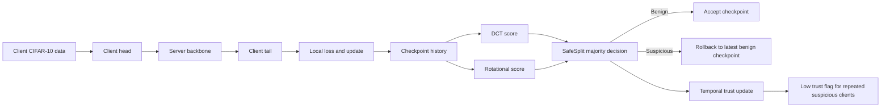

# SafeSplit Midterm Reproduction

This repository reproduces the midterm scope of **SafeSplit: A Novel Defense Against Client-Side Backdoor Attacks in Split Learning** (NDSS 2025). The project implements U-shaped split learning on CIFAR-10, client-side pixel and semantic backdoor attacks, the SafeSplit defense with frequency and rotational analysis, rollback to benign checkpoints, reduced baselines, and a temporal trust score extension for slow poisoning.

## Notebook Workflow

`SafeSplit_walkthrough.ipynb` is the main interface for the project. It explains the implementation step by step, runs the reproduction experiments, formats the paper-aligned tables, and evaluates the extension.

The experiment preset is controlled by `NOTEBOOK_EXPERIMENT_PRESET`:

| Preset | Use |
| --- | --- |
| `lite` | Fast sanity checks |
| `medium` | Interactive notebook runs |
| `paper` | Main reported results |

The same experiment runner is shared with `main.py` and `run_experiments.py`, so experiments can also be launched from Python scripts when needed.

## Pipeline Overview

The split model is organized as `client head -> server backbone -> client tail`. After each client update, SafeSplit compares recent backbone checkpoints using low frequency DCT signatures and rotational signatures. Updates that fit the benign majority are kept. Suspicious updates trigger rollback to the latest benign checkpoint. The extension adds a temporal trust score on top of SafeSplit to track clients that repeatedly show mild suspicious behavior.



## Repository Layout

```text
SafeSplit_Distributed_DL/
├─ SafeSplit_walkthrough.ipynb   # main explanation, experiments, tables, plots
├─ main.py                       # shared experiment runner
├─ run_experiments.py            # optional batch runner
├─ config.py                     # presets and experiment parameters
├─ evaluate.py                   # MA and BA evaluation
├─ data/
│  ├─ dataset.py                 # CIFAR-10 loading and client partitioning
│  └─ backdoor.py                # pixel, semantic, and scheduled poisoning
├─ models/
│  └─ split_models.py            # client head, server backbone, client tail
├─ training/
│  └─ trainer.py                 # split learning loop
├─ defense/
│  ├─ safesplit.py               # SafeSplit and temporal trust defense
│  └─ baselines.py               # DP and KRUM style baselines
├─ results/                      # optional JSON outputs
└─ assets/readme/                # figures used in this report
```

## Execution

```bash
pip install -r requirements.txt
```

The recommended path is to open `SafeSplit_walkthrough.ipynb`, set `NOTEBOOK_EXPERIMENT_PRESET = "paper"`, restart the kernel, and run all cells. The notebook selects a reporting seed for the formal comparison suite and prints a reproduction sanity check before the extension section.

Optional CLI examples:

```bash
python main.py --preset paper --defense safesplit --backdoor semantic
python run_experiments.py --preset paper
```

## Main Results

The reported notebook run uses the `paper` preset and selected reporting seed `42`. The sanity check passed with SafeSplit semantic backdoor accuracy at `0.0` in the checked Table II and Table III rows.

### Table II Comparison

This comparison matches the paper's attack and defense layout. With no defense, both semantic and pixel attacks produce near perfect backdoor accuracy. SafeSplit suppresses the semantic attack completely and strongly reduces the pixel attack while keeping main task accuracy in the same range.


### Table III IID Sweep

This sweep evaluates the semantic attack at IID rates `0.6`, `0.8`, and `1.0`. The undefended runs keep `BA = 100.0` at every IID rate. SafeSplit keeps `BA = 0.0` across all three IID settings, which resolves the previous caveat where the `IID = 0.6` SafeSplit row failed.


### Reduced Baselines

The baseline panel compares no defense, simplified DP, a KRUM style distance baseline, and SafeSplit at `IID = 0.6` under a semantic attack. SafeSplit reaches `BA = 0.0` with higher `MA` than the other successful defense baselines in this run.


## Extension: Temporal Trust Score

The extension keeps the original SafeSplit reproduction unchanged and adds a slow poisoning experiment. A malicious client starts with mild poisoning and gradually increases the poison rate. SafeSplit still handles checkpoint rollback, while the trust score tracks repeated suspicious behavior by client.

Trust update rule:

```text
if suspiciousness < soft_threshold and update is in the SafeSplit benign set:
    trust = min(1.0, trust + reward)
else:
    trust = max(0.0, trust - penalty * suspiciousness)

client is low trust if trust <= trust_threshold
```

The reported settings are `reward = 0.02`, `penalty = 0.10`, `soft_threshold = 0.60`, and `trust_threshold = 0.70`. The client set is fixed during training.


The slow poisoning results satisfy the extension criteria: no defense gives `BA = 100.0`, SafeSplit gives `BA = 0.0`, and SafeSplit with temporal trust also gives `BA = 0.0`. The trust version keeps similar `MA` to SafeSplit (`39.51` vs `39.08`), lowers malicious client trust to `0.63`, keeps benign trust higher at `0.82`, and produces `3` low trust flags.

## Mapping To The Paper

`TABLE_II_CASES` in the notebook corresponds to the paper's Table II style defense comparison. `TABLE_III_CASES` corresponds to the IID rate sweep in Table III. `BASELINE_CASES` gives the reduced baseline comparison used for the midterm report. The earlier notebook cells are explanatory and are not used as formal paper table results.

## Summary

The final run is submission ready. SafeSplit removes the semantic backdoor in the formal Table II and Table III comparisons, reduces the pixel backdoor substantially, and outperforms the reduced baselines on the main `IID = 0.6` semantic case. The temporal trust extension adds a clear slow poisoning scenario and shows that repeated mild suspicious behavior can be captured without sacrificing the SafeSplit backdoor defense.
